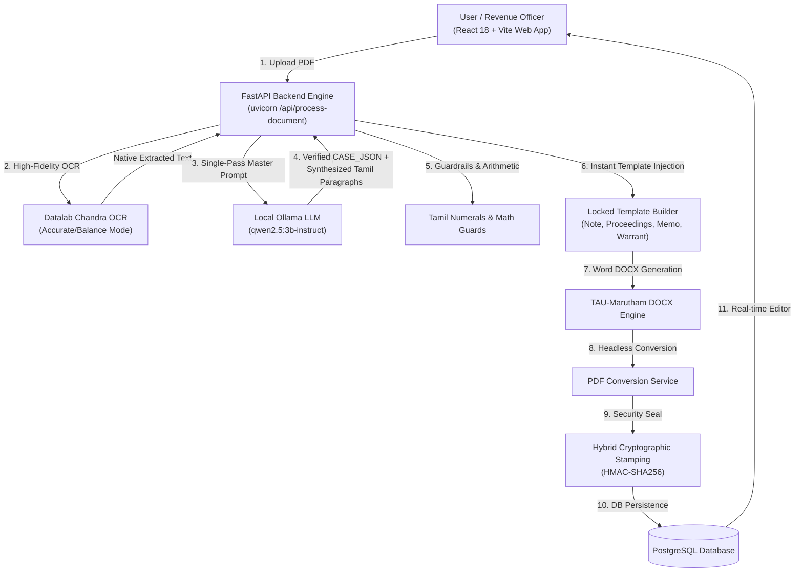

# Revenue Recovery (RR) Proceedings Assistant — AI Administrative Co-Pilot v2.0

> **Automated Legal Order Analysis, Section 5 Revenue Recovery Proceedings & Official Memorandum Generation System for Tamil Nadu District Collectorates**

[](https://react.dev/)
[](https://vitejs.dev/)
[](https://fastapi.tiangolo.com/)
[](https://python.org/)
[](https://www.postgresql.org/)
[](https://datalab.to/)
[-black?logo=ollama)](https://ollama.com/)

---

## 🏛️ System Overview

**RR Proceedings Assistant** is an on-premise, production-grade AI Administrative Co-Pilot built specifically for **Tamil Nadu District Collectorates** (pioneered for **Erode Collectorate, Section E2 / ஈரோடு மாவட்ட ஆட்சியர் அலுவலகம், பிரிவு ஈ2**).

The system ingests court decrees, customs recovery certificates, tribunal orders, and department demand notices, extracts all legal, financial, and jurisdictional entities with **zero hardcoding**, synthesizes government-compliant Tamil prose (*ஆட்சிமொழித் தமிழ்*), and deterministically populates official locked government templates strictly rendered in the **`TAU-Marutham`** Tamil font with **Hybrid Cryptographic HMAC Seals**.

### Official Proceeding Types Generated:
1. **செயல்முறைகள் (Collector's Revenue Recovery Proceedings Order)** — Formal recovery mandate under Tamil Nadu Revenue Recovery Act, 1864 Section 5 & RSO 41 empowering the Taluk Tahsildar to recover dues from movable/immovable assets and bank accounts.
2. **குறிப்பாணை (Memorandum / Memo)** — Administrative forwarding directions and reminders to Sub-Collectors, DROs, and Tahsildars.
3. **அலுவலகக் குறிப்பு (Office Note File Order)** — Internal Section Clerk / Superintendent note file submission for District Collector / DRO approval.
4. **ஜப்தி மற்றும் கைது வாரண்ட் ஆணை (Execution Warrant)** — Distraint and arrest warrant for family court maintenance arrears under BNSS 144 / CrPC 125.

### Supported Department Statutory Frameworks:
- **Customs Act, 1962 (Section 142(1)(c)(ii))** — Export/Import duty arrears, IEC recovery & penalty demands.
- **Tamil Nadu Revenue Recovery Act, 1864 (Section 5 & RSO 41)** — General land revenue & statutory arrears.
- **Motor Vehicles Act, 1988 (Section 174)** — Motor Accidents Claims Tribunal (MCOP) compensation awards.
- **Commercial Taxes & GST (TNGST / CGST Acts)** — Tax recovery certificates and penalty arrears.
- **TNRERA Act, 2016 (Section 40(1))** — Real Estate Regulatory Authority recovery warrants.
- **BNSS 144 / CrPC 125** — Judicial magistrate family maintenance recovery warrants.

---

## ⚡ Automated 1-Click Setup (`setup.ps1`)

An automated PowerShell script is included in the project root to configure the entire system automatically in one command.

```powershell
.\setup.ps1
```

### What `setup.ps1` Does:
1. **Prerequisite Check**: Validates Python 3.10+ and Node.js / npm in your system PATH.
2. **Environment Configuration**: Copies `.env.example` $\rightarrow$ `.env` and synchronizes `Backend/.env`.
3. **Virtual Environment**: Creates `Backend/.venv`, upgrades pip, and installs `requirements.txt`.
4. **Database Migration & Auto-Sync**: Creates all tables and drops legacy NOT NULL constraints.
5. **Seeder Execution**: Seeds administrative credentials (`admin@erode.tn.gov.in`, `user@erode.tn.gov.in`), locked templates, and Erode taluk configurations.
6. **Frontend Dependencies**: Installs all Vite & React npm packages.
7. **Ollama Check**: Validates connectivity to the local LLM model (`qwen2.5:3b-instruct-q4_K_M`).

---

## 🏗️ Architecture & Pipeline Flow



### Single-Pass Extraction & Instant Synthesis:
- The **Master Prompt** in `llm_service.py` extracts all case data and synthesizes all document-specific paragraphs in **one unified call**.
- The document drafting engine in `document_service.py` immediately consumes these synthesized paragraphs, eliminating redundant LLM round-trips and generating all 4 documents in milliseconds!

---

## 🛠️ Manual Installation & Setup

### 1. Prerequisites
- **Python**: 3.10 or higher
- **Node.js**: 18.0 or higher
- **PostgreSQL**: 14 or higher (Running on `localhost:5432` with database `rr_proceedings_db`)
- **Ollama**: Installed with `qwen2.5:3b-instruct-q4_K_M` (`ollama run qwen2.5:3b-instruct`)

### 2. Environment Configuration
Create `.env` in the root directory:
```env
# Database Configuration
PG_HOST=localhost
PG_PORT=5432
PG_DB=rr_proceedings_db
PG_USER=postgres
PG_PASSWORD=your_password

# OCR Engine
OCR_VERSION=Chandra-v2
DATALAB_API_KEY=your_datalab_key

# Ollama LLM Engine
OLLAMA_BASE_URL=http://127.0.0.1:11434
OLLAMA_MODEL=qwen2.5:3b-instruct-q4_K_M
OLLAMA_TIMEOUT_SECONDS=240

# Security Pepper & JWT
SECRET_KEY=09d25e094faa6ca2556c818166b7a9563b93f7099f6f0f4caa6cf63b88e8d3e7
CRYPTO_PEPPER=TN-GOV-RR-PROCEEDINGS-SECURE-PEPPER-2026
```

### 3. Backend Setup
```powershell
cd Backend
python -m venv .venv
.\.venv\Scripts\Activate.ps1
pip install --upgrade pip
pip install -r requirements.txt
```

### 4. Database Initialization & Seeders
Run the Python lifespan initialization:
```powershell
.\.venv\Scripts\python.exe -c "import asyncio; from app.core.database import engine, Base, ensure_db_schema_migrated, AsyncSessionLocal; from app.core.seed import seed_default_accounts, seed_default_templates; async def init(): async with engine.begin() as conn: await conn.run_sync(Base.metadata.create_all); await ensure_db_schema_migrated(); async with AsyncSessionLocal() as s: await seed_default_accounts(s); await seed_default_templates(s); asyncio.run(init())"
```

### 5. Frontend Setup
```powershell
cd ../Frontend
npm install
```

---

## 🚀 Running the Application

### Terminal 1: Backend API
```powershell
cd Backend
.\.venv\Scripts\uvicorn.exe app.main:app --reload --host 0.0.0.0 --port 8000
```

### Terminal 2: Frontend Web Client
```powershell
cd Frontend
npm run dev
```

### Web Endpoints:
- **Frontend App**: `http://localhost:5173`
- **Swagger REST API Docs**: `http://localhost:8000/docs`

---

## 🔑 User Authentication & Role-Based Access Control (Database-Centric)

All user accounts, roles, jurisdictions, and hashed credentials are **retrieved and verified strictly from the PostgreSQL Database (`users` table)**. Credentials are never stored in or loaded from `.env`:

- **Initial DB Bootstrap**: On first database initialization, standard initial roles (`admin`, `user`, `auditor`) are seeded directly into the `users` table.
- **Dynamic Profile & User Management**: District Administrators can create, deactivate, assign taluks, and update passwords for revenue officers directly via the **Admin Workspace UI** or database.
- **Strict Verification**: JWT issuance verifies credentials exclusively via `SELECT ... FROM users` and bcrypt hash comparison.

---

## 📂 Repository File Tree

```
POC-RR-2-PROCEEDINGS/
├── setup.ps1                                   # Automated 1-click installer
├── SYSTEM_ARCHITECTURE_AND_SETUP_GUIDE.md      # In-depth architectural playbook
├── .env                                        # Root environment variables
│
├── Backend/
│   ├── app/
│   │   ├── api/v1/endpoints/                   # REST endpoints (auth, pipeline, templates, users, audit)
│   │   ├── core/
│   │   │   ├── config.py                       # Pydantic Settings
│   │   │   ├── database.py                     # Async SQLAlchemy & migrations
│   │   │   ├── seed.py                         # Default templates, users, office configs
│   │   │   └── logging.py                      # Structured logging
│   │   ├── domain/
│   │   │   ├── models.py                       # PostgreSQL ORM entities
│   │   │   ├── schemas/                        # Pydantic validation schemas
│   │   │   └── rules/                          # Tamil numerals, department registries
│   │   ├── services/
│   │   │   ├── pipeline_service.py             # End-to-end pipeline orchestrator
│   │   │   ├── ocr_service.py                  # Datalab Chandra OCR
│   │   │   ├── llm_service.py                  # Single-Pass Master Prompt
│   │   │   ├── document_service.py             # Locked templates & TAU-Marutham DOCX
│   │   │   ├── pdf_service.py                  # Word COM / LibreOffice PDF converter
│   │   │   └── audit_service.py                # Cryptographic audit ledger
│   │   └── main.py                             # FastAPI entry point & lifespan
│   ├── requirements.txt
│   └── outputs/                                # Generated DOCX & PDF orders
│
└── Frontend/
    ├── src/
    │   ├── components/
    │   │   ├── workspace/                      # RRAssistantView, TemplateDocumentEditor
    │   │   ├── admin/                          # TemplateManagement, UserManagement
    │   │   └── upload/                         # UploadLanding, ProcessingOverlay
    │   ├── services/apiService.js              # Backend API connector
    │   ├── App.jsx
    │   └── index.css                           # Design system & TAU-Marutham typography
    ├── package.json
    └── vite.config.js
```

---

## 🛡️ Operational FAQs & Troubleshooting

### Q: Why did Ollama take ~100s to process a document?
**A:** When running on CPU without dedicated GPU acceleration, tokenizing multi-byte Tamil characters takes ~100–180 seconds. We increased `OLLAMA_TIMEOUT_SECONDS=240` in `.env` to ensure completion. For 10x faster speeds (~2-5 seconds), enable GPU acceleration in Ollama (`OLLAMA_NUM_GPU=99`).

### Q: How are locked template slots filled?
**A:** `document_service.py` injects verified values into immutable official boilerplate text. The LLM cannot hallucinate reference numbers, dates, or amounts; only verified fields from the case JSON are merged into `«...»` slots.

### Q: Where do generated documents get stored?
**A:** All output documents (`Office_Note_{job_id}.docx`, `Proceedings_{job_id}.docx`, `Memorandum_{job_id}.docx`, and corresponding `.pdf` files) are saved in [`Backend/outputs/`](file:///e:/Projects/Active/POC-RR-2-PROCEEDINGS/Backend/outputs).
