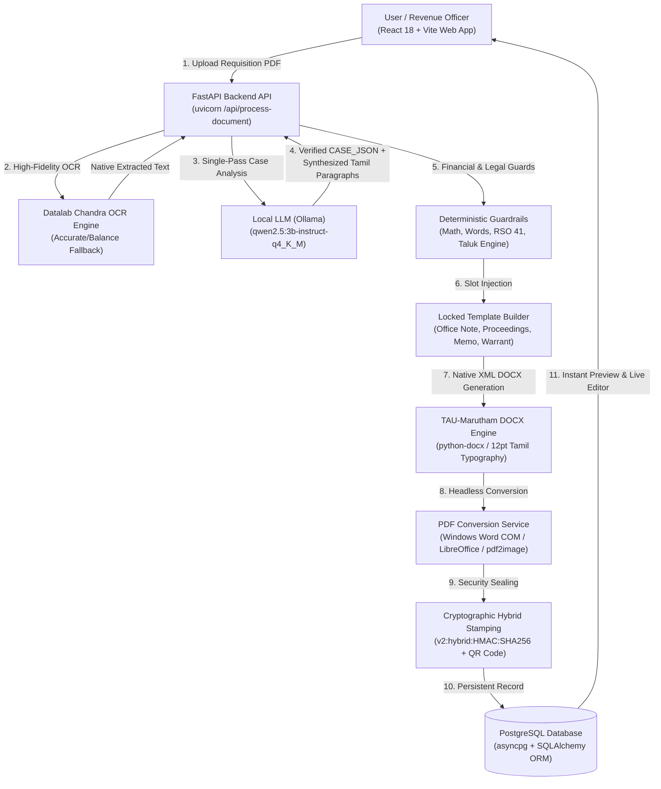
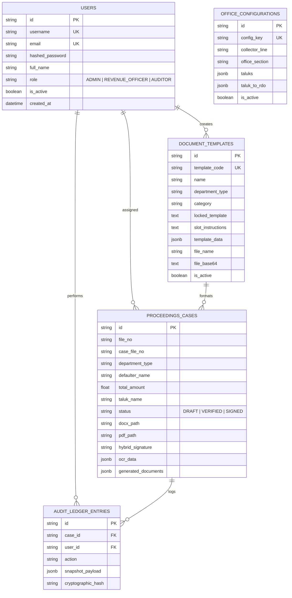

# Tamil Nadu Revenue Recovery (RR) Proceedings Drafting System v2.0
## Complete Technical Architecture, Dataflow Lifecycle & Setup Documentation

---

## 1. Executive Summary & System Purpose

The **Tamil Nadu Revenue Recovery (RR) Proceedings Drafting System** is an enterprise-grade AI and deterministic document automation platform custom-tailored for the **Erode District Collectorate (ஈரோடு மாவட்ட ஆட்சியர் அலுவலகம், பிரிவு ஈ2)**. 

### Core Problem Solved
When government departments (Customs, Commercial Taxes, TNRERA, Transport, Excise, Cooperatives) or judicial courts (MCOP Tribunal, Family Courts) requisition the District Collector to recover unpaid dues under the **Tamil Nadu Revenue Recovery Act, 1864 (Act II of 1864)** and **Revenue Standing Order 41 (RSO 41)**, administrative revenue officers must manually inspect complex legal orders and draft 4 distinct official government proceedings in formal administrative Tamil (*ஆட்சிமொழித் தமிழ்*).

### System Solution
This platform ingests raw scanned PDFs / images, extracts text via Datalab Chandra OCR, executes single-pass legal entity analysis via a specialized Master Prompt on local LLMs (Ollama Qwen2.5), deterministically populates locked government templates, generates pixel-perfect `.docx` files formatted with the official `TAU-Marutham` font, renders signed PDF documents, and seals them with an anti-tamper **Hybrid Cryptographic Signature (HMAC-SHA256)**.

---

## 2. End-to-End Architectural Blueprint



---

## 3. Detailed Component Breakdown

### 1. Ingestion & OCR Layer ([`ocr_service.py`](file:///e:/Projects/Active/POC-RR-2-PROCEEDINGS/Backend/app/services/ocr_service.py))
- **Engine**: Datalab Chandra Marker OCR API (`https://www.datalab.to/api/v1/marker`) with dual-mode fallback (`accurate` $\rightarrow$ `balance`).
- **Page Rasterization**: `pypdfium2` and `Pillow` render all pages of input PDFs/scans to high-resolution images, routing every page directly through visual OCR for consistent extraction across complex scanned documents.

### 2. LLM Case Analysis Engine ([`llm_service.py`](file:///e:/Projects/Active/POC-RR-2-PROCEEDINGS/Backend/app/services/llm_service.py))
- **Zero-Hardcoding Master Prompt**: Extracts 25+ legal fields including Defaulter Name, Address, Revenue Taluk, District, Claiming Department, Statutory Provisions, Reference Numbers, Dates, Principal Dues, Penalties, Interest, and Demand Draft payee details.
- **Single-Pass Synthesis**: In addition to JSON metadata, the Master Prompt drafts all required administrative Tamil prose (`note_para1`, `note_para2`, `order_para1`, `order_para2`, `order_para3`, `memo_para1`, `memo_para2`, `memo_para3`) in one unified LLM call.
- **Arithmetic & Word Translators**: Number-to-Tamil-words converter ([`tamil_numerals.py`](file:///e:/Projects/Active/POC-RR-2-PROCEEDINGS/Backend/app/domain/rules/tamil_numerals.py)) guarantees exact currency strings (e.g. `ரூ. 1,50,000/-` $\rightarrow$ `ஒரு இலட்சத்து ஐம்பதாயிரம் ரூபாய் மட்டும்`) with zero hallucination.

### 3. Locked Template & Drafting Engine ([`document_service.py`](file:///e:/Projects/Active/POC-RR-2-PROCEEDINGS/Backend/app/services/document_service.py))
The system produces 4 official documents per case:
1. **Office Note (`Office_Note_{job_id}.docx`)**: Internal file note for the District Collector / DRO approval under RSO 41 & Section 5.
2. **Collector's Proceedings Order (`Proceedings_{job_id}.docx`)**: Statutory order empowering the Jurisdictional Tahsildar.
3. **Collectorate Memorandum (`Memorandum_{job_id}.docx`)**: Official forwarding communication sent to the Tahsildar with references and follow-up reminders.
4. **Distraint Warrant (`Warrant_{job_id}.docx`)**: Property attachment and execution order (specifically generated for maintenance arrears under BNSS 144 / CrPC 125).

### 4. Typography & DOCX Engine
- **Font**: Enforces the official Tamil Nadu government standard font `TAU-Marutham` across all headers, body paragraphs, and reference tables.
- **Locked Black Text**: All government boilerplate headings, signature blocks, and statutory references are immutable; only variable slots (`«...»`) are filled with verified facts.

### 5. Hybrid Cryptographic Stamping ([`pipeline_service.py`](file:///e:/Projects/Active/POC-RR-2-PROCEEDINGS/Backend/app/services/pipeline_service.py))
- Generates a tamper-proof seal in the format: `v2:hybrid:<HMAC_SHA256>:<SHA256_PAYLOAD>`.
- Incorporates a keyed server-side secret (`CRYPTO_PEPPER`) ensuring any modification to names, dates, or amounts invalidates the signature during verification.

---

## 4. Database Schema & Data Models

The system uses **PostgreSQL** with asynchronous connections via `asyncpg` and `SQLAlchemy 2.0`.

### Key Tables & Entities ([`models.py`](file:///e:/Projects/Active/POC-RR-2-PROCEEDINGS/Backend/app/domain/models.py))



---

## 5. Automated One-Click Setup (`setup.ps1`)

An automated PowerShell script [`setup.ps1`](file:///e:/Projects/Active/POC-RR-2-PROCEEDINGS/setup.ps1) is provided in the project root to configure everything in one command.

### Running Automated Setup:
Open PowerShell in the project root and execute:
```powershell
.\setup.ps1
```

### What `setup.ps1` Automatically Does:
1. **Prerequisite Check**: Validates Python 3.10+ and Node.js / npm in system PATH.
2. **Environment Synchronization**: Copies `.env.example` $\rightarrow$ `.env` and syncs `Backend/.env`.
3. **Python Virtual Environment**: Creates `Backend/.venv`, upgrades pip, and installs `requirements.txt`.
4. **Database Table Synchronization & Constraints**: Synchronizes SQLAlchemy models with PostgreSQL and relaxes legacy constraints (`DROP NOT NULL`).
5. **Seeder Execution**:
   - Seeds initial bootstrap Administrator, Revenue Officer, and Section Superintendent accounts directly into the database `users` table.
   - Seeds official locked templates for Office Note, Proceedings, Memorandum, and Maintenance Warrant with base64 DOCX assets.
   - Seeds Erode District taluk-to-RDO jurisdiction routing maps.
6. **Frontend Installation**: Installs all Node modules in `Frontend/` via `npm install`.
7. **Ollama Validation**: Checks if Ollama is running on `127.0.0.1:11434` and validates the `qwen2.5:3b-instruct` model.

---

## 6. Manual Step-by-Step Setup Guide

If you prefer to run each step manually:

### Step 1: Environment Variables
Ensure `.env` in the root contains:
```env
# Database Configuration
PG_HOST=localhost
PG_PORT=5432
PG_DB=rr_proceedings_db
PG_USER=postgres
PG_PASSWORD=your_password

# OCR Engine
OCR_VERSION=Chandra-v2
DATALAB_API_KEY=your_key_here

# Ollama LLM Configuration
OLLAMA_BASE_URL=http://127.0.0.1:11434
OLLAMA_MODEL=qwen2.5:3b-instruct-q4_K_M
OLLAMA_TIMEOUT_SECONDS=240

# Security Pepper
SECRET_KEY=09d25e094faa6ca2556c818166b7a9563b93f7099f6f0f4caa6cf63b88e8d3e7
CRYPTO_PEPPER=TN-GOV-RR-PROCEEDINGS-SECURE-PEPPER-2026
```

### Step 2: Backend Virtual Environment & Dependencies
```powershell
cd Backend
python -m venv .venv
.\.venv\Scripts\Activate.ps1
pip install --upgrade pip
pip install -r requirements.txt
```

### Step 3: Database & Seeder Initialization
Start PostgreSQL, then run the startup lifespan:
```powershell
.\.venv\Scripts\python.exe -c "import asyncio; from app.core.database import engine, Base, ensure_db_schema_migrated, AsyncSessionLocal; from app.core.seed import seed_default_accounts, seed_default_templates; async def init(): async with engine.begin() as conn: await conn.run_sync(Base.metadata.create_all); await ensure_db_schema_migrated(); async with AsyncSessionLocal() as s: await seed_default_accounts(s); await seed_default_templates(s); asyncio.run(init())"
```

### Step 4: Frontend Installation
```powershell
cd ../Frontend
npm install
```

### Step 5: Start Development Servers
**Terminal 1 (Backend API):**
```powershell
cd Backend
.\.venv\Scripts\uvicorn.exe app.main:app --reload --host 0.0.0.0 --port 8000
```

**Terminal 2 (Frontend UI):**
```powershell
cd Frontend
npm run dev
```

- **Frontend Application**: `http://localhost:5173`
- **Interactive OpenAPI Documentation**: `http://localhost:8000/docs`

---

## 7. Operational Troubleshooting & Pitfalls

| Symptom | Root Cause | Solution |
| :--- | :--- | :--- |
| `Ollama failed (ReadTimeout)` | CPU-only LLM inference on large Tamil text takes >75s | Set `OLLAMA_TIMEOUT_SECONDS=240` in `.env` or enable GPU acceleration in Ollama (`OLLAMA_NUM_GPU=99`). |
| `null value in column "subject_template" violates not-null` | Legacy constraint in existing Postgres table | Run [`ensure_db_schema_migrated()`](file:///e:/Projects/Active/POC-RR-2-PROCEEDINGS/Backend/app/core/database.py#L54) which executes `ALTER TABLE document_templates ALTER COLUMN subject_template DROP NOT NULL;`. |
| Word PDF conversion warning | Microsoft Word COM object not registered on Windows server | System automatically falls back to LibreOffice / direct headless rendering. |
| Tamil font appears broken in Word | Missing `TAU-Marutham` font in Windows Fonts | Install the official `TAU-Marutham.ttf` font in `C:\Windows\Fonts`. |
