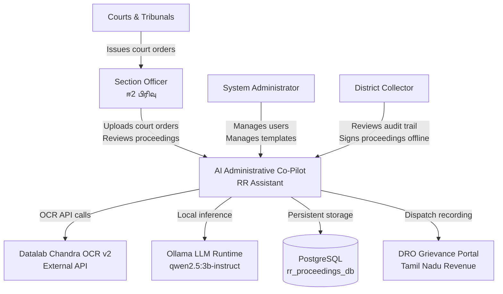
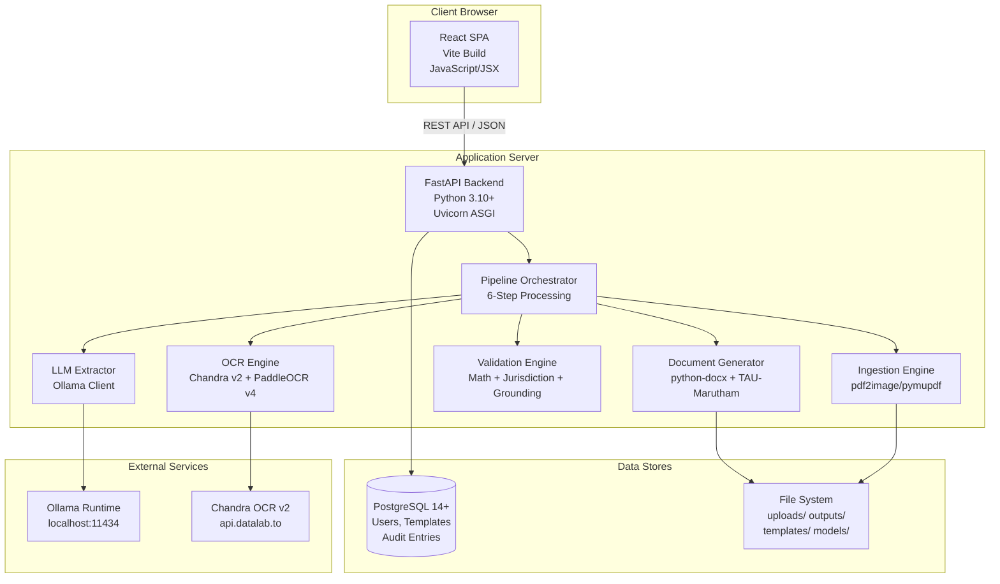
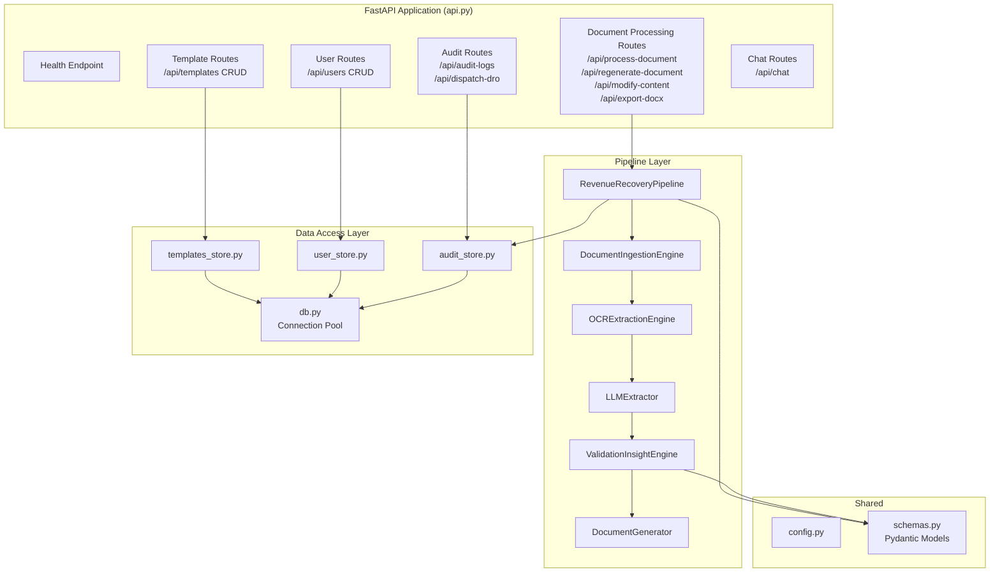

# Architecture Decision Records (ADR) & System Architecture

> **Document ID**: RR-ARCH-001  
> **Version**: 2.0  
> **Date**: 2026-09-28  
> **Status**: ACCEPTED

---

## Architecture Overview

### C4 Context Diagram



### C4 Container Diagram



### C4 Component Diagram — Backend



---

## Architecture Decision Records

### ADR-001: Local LLM vs Cloud LLM

| Aspect | Decision |
|---|---|
| **Status** | ACCEPTED |
| **Context** | Government documents contain PII (names, addresses, case numbers). Data sovereignty is a legal requirement. |
| **Decision** | Use Ollama with qwen2.5:3b-instruct running on-premises. Zero data leaves the server. |
| **Consequences** | (+) Full data sovereignty. (+) Zero API costs. (+) Works offline. (-) Limited model size (3B params). (-) Requires server with 8GB+ RAM. |
| **Alternatives Rejected** | OpenAI GPT-4 (data leaves premises), Google Gemini (same), Claude (same). |

### ADR-002: Dual OCR Engine Strategy

| Aspect | Decision |
|---|---|
| **Status** | ACCEPTED |
| **Context** | Tamil OCR is hard. No single engine handles all scan qualities. Government offices may not always have internet. |
| **Decision** | Primary: Chandra OCR v2 (cloud, best quality). Fallback: PaddleOCR v4 ONNX (offline, local). Automatic failover on timeout or error. |
| **Consequences** | (+) Best-quality OCR when online. (+) Always works offline. (-) Two engines to maintain. (-) Chandra requires API key. |
| **Alternatives Rejected** | Tesseract (poor Tamil accuracy), Google Vision API (data sovereignty), single local engine (insufficient quality). |

### ADR-003: Modular Monolith vs Microservices

| Aspect | Decision |
|---|---|
| **Status** | ACCEPTED |
| **Context** | Single district deployment, 10 concurrent users, single-team development. |
| **Decision** | Modular monolith — single FastAPI process with clear module boundaries. |
| **Consequences** | (+) Simple deployment. (+) Single process to monitor. (+) No inter-service communication overhead. (-) Must refactor for multi-district scale-out. |
| **Alternatives Rejected** | Microservices (operational overhead for a 10-user system), serverless (no local deployment). |

### ADR-004: PostgreSQL as Single Database

| Aspect | Decision |
|---|---|
| **Status** | ACCEPTED |
| **Context** | Need reliable storage for users, templates, and audit trail. Government IT familiar with PostgreSQL. JSONB support needed for flexible entity storage. |
| **Decision** | PostgreSQL 14+ as the single database for all persistent data. |
| **Consequences** | (+) Mature, reliable, government-approved. (+) JSONB for flexible entity storage. (+) Strong ACID compliance for audit integrity. (-) No document database for full-text search (acceptable for current scale). |
| **Alternatives Rejected** | SQLite (no concurrent access), MongoDB (not government standard), MySQL (weaker JSONB support). |

### ADR-005: TAU-Marutham Font Compliance

| Aspect | Decision |
|---|---|
| **Status** | ACCEPTED |
| **Context** | Tamil Nadu government mandates TAU-Marutham font for all official Tamil documents. |
| **Decision** | Set TAU-Marutham as the exclusive font for every `Run` object in generated DOCX. No fallback to other Tamil fonts in document output. |
| **Consequences** | (+) Full government compliance. (+) Consistent typography. (-) Font must be installed on the server. (-) Limited to TAU-Marutham character set. |

### ADR-006: Pydantic for LLM Output Validation

| Aspect | Decision |
|---|---|
| **Status** | ACCEPTED |
| **Context** | LLMs can hallucinate, produce malformed JSON, or miss required fields. Legal documents demand accuracy. |
| **Decision** | Define strict Pydantic schemas (`ExtractedLegalEntities`) and validate all LLM output against them. Reject and retry on validation failure. |
| **Consequences** | (+) Zero tolerance for malformed data. (+) Self-documenting data contracts. (+) Type safety throughout pipeline. (-) LLM must produce exact JSON format (mitigated by function calling / JSON mode). |

### ADR-007: Header-Based RBAC vs JWT

| Aspect | Decision |
|---|---|
| **Status** | ACCEPTED (with note for future upgrade) |
| **Context** | Internal government office network. Low user count. Fast deployment required. |
| **Decision** | Use `x-user-role` and `x-user-id` headers for RBAC. Client sets headers based on login state. |
| **Consequences** | (+) Simple implementation. (+) Fast to deploy. (-) Not cryptographically secure — headers can be spoofed. **NOTE**: Must upgrade to JWT/session tokens before any external-facing deployment. |

### ADR-008: File System for Document Storage

| Aspect | Decision |
|---|---|
| **Status** | ACCEPTED |
| **Context** | Generated DOCX files need to be served for download. Uploaded files need temporary storage. |
| **Decision** | Use local file system with organized directories: `uploads/`, `outputs/`, `templates/`, `models/`. |
| **Consequences** | (+) Simple, fast, no additional infrastructure. (+) Compatible with government hardware. (-) No built-in backup (must configure OS-level backup). (-) No CDN for high-traffic (not needed for internal use). |

---

## Scalability Considerations

### Current Architecture Limits

| Dimension | Current Limit | Bottleneck |
|---|---|---|
| Concurrent users | 10 | Uvicorn worker threads, Ollama inference |
| Documents per day | ~100 | LLM inference time (20s per doc) |
| Storage | 20 GB/year | Local disk |
| Database size | ~1 GB/year (audit logs) | PostgreSQL single node |

### Future Scale-Out Path

```
Phase 1 (Current): Single District
├── 1 server, 1 PostgreSQL, 1 Ollama

Phase 2: Multi-District (Same State)
├── 1 server per district (identical deployments)
├── Shared template library (sync via Git)
├── Independent databases

Phase 3: State-Level Federation
├── Central PostgreSQL for cross-district reporting
├── District servers push anonymized metrics
├── Central admin for statewide template management
└── Requires: API gateway, auth service, data sync
```

---

*Architecture decisions are reviewed quarterly and updated as the system evolves.*
