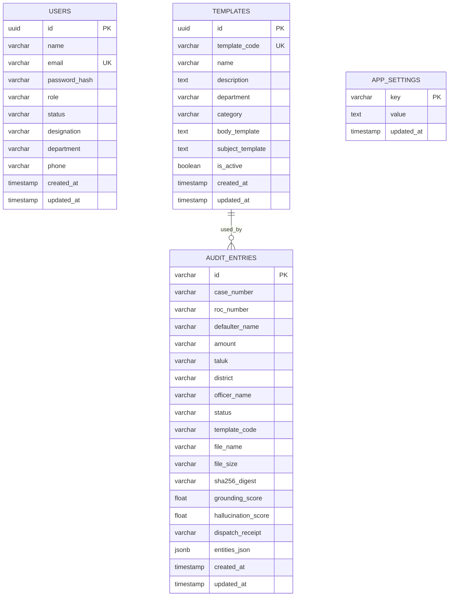

# Database Design Document

> **Document ID**: RR-DB-001  
> **Version**: 2.0  
> **Date**: 2026-09-28  
> **Database**: PostgreSQL 14+  
> **Schema**: `public` (default)  
> **Status**: APPROVED

---

## 1. Overview

The RR Assistant uses PostgreSQL as its single source of truth for all persistent application data. The database stores:
- **User accounts** with role-based access control
- **Proceedings templates** per department type
- **Audit trail entries** with immutable metadata and full entity snapshots
- **Application settings** for runtime configuration

All file-based data (uploaded documents, generated DOCX/PDF, OCR models) is stored on the local file system and referenced by path in the database.

---

## 2. Entity-Relationship Diagram



---

## 3. Table Specifications

### 3.1 `users` Table

```sql
CREATE TABLE IF NOT EXISTS users (
    id              UUID PRIMARY KEY DEFAULT gen_random_uuid(),
    name            VARCHAR(255) NOT NULL,
    email           VARCHAR(255) UNIQUE NOT NULL,
    password_hash   VARCHAR(255) NOT NULL,
    role            VARCHAR(20) NOT NULL DEFAULT 'user'
                    CHECK (role IN ('admin', 'user')),
    status          VARCHAR(20) NOT NULL DEFAULT 'active'
                    CHECK (status IN ('active', 'inactive', 'suspended')),
    designation     VARCHAR(255),
    department      VARCHAR(255),
    phone           VARCHAR(20),
    created_at      TIMESTAMP WITH TIME ZONE DEFAULT NOW(),
    updated_at      TIMESTAMP WITH TIME ZONE
);

-- Indexes
CREATE INDEX idx_users_email ON users(email);
CREATE INDEX idx_users_role ON users(role);
CREATE INDEX idx_users_status ON users(status);
```

**Constraints**:
- `email` must be unique (login identifier)
- `role` restricted to `admin` or `user`
- `status` restricted to `active`, `inactive`, or `suspended`
- `password_hash` stores bcrypt hash (never plaintext)

**Sample Data**:
```sql
INSERT INTO users (name, email, password_hash, role, designation, department) VALUES
('S. Ramanathan', 'ramanathan@tn.gov.in', '$2b$12$...', 'user', 'Section Officer ஈ2', 'Revenue'),
('Admin', 'admin@tn.gov.in', '$2b$12$...', 'admin', 'IT Administrator', 'IT');
```

### 3.2 `templates` Table

```sql
CREATE TABLE IF NOT EXISTS templates (
    id                  UUID PRIMARY KEY DEFAULT gen_random_uuid(),
    template_code       VARCHAR(100) UNIQUE NOT NULL,
    name                VARCHAR(255) NOT NULL,
    description         TEXT,
    department          VARCHAR(100) NOT NULL
                        CHECK (department IN ('MCOP', 'CUSTOMS', 'RERA', 'WARRANT', 'GENERAL')),
    category            VARCHAR(100),
    body_template       TEXT NOT NULL,
    subject_template    TEXT,
    is_active           BOOLEAN DEFAULT TRUE,
    created_at          TIMESTAMP WITH TIME ZONE DEFAULT NOW(),
    updated_at          TIMESTAMP WITH TIME ZONE
);

-- Indexes
CREATE INDEX idx_templates_code ON templates(template_code);
CREATE INDEX idx_templates_department ON templates(department);
CREATE INDEX idx_templates_active ON templates(is_active) WHERE is_active = TRUE;
```

**Template Body Format**: Uses `{{variable}}` mustache-style placeholders:
```
{{district}} மாவட்ட ஆட்சித் தலைவர் அவர்களின் செயல்முறைகள்
முன்னிலை: {{collector_name}}

ந.க. {{roc_number}}    நாள்: {{proceedings_date}}

பொருள்: {{subject}}

பார்வை: {{references}}

உத்தரவு: {{order_body}}
```

**Seed Templates**:

| template_code | department | name |
|---|---|---|
| `mcop_form5` | MCOP | Motor Claims Proceedings (Form 5) |
| `customs_142` | CUSTOMS | Customs Act §142 Recovery Notice |
| `rera_recovery` | RERA | RERA Recovery Order |
| `court_warrant_exec` | WARRANT | Court Warrant Execution |
| `general_rr` | GENERAL | General Revenue Recovery |

### 3.3 `audit_entries` Table

```sql
CREATE TABLE IF NOT EXISTS audit_entries (
    id                  VARCHAR(100) PRIMARY KEY,
    case_number         VARCHAR(255) NOT NULL,
    roc_number          VARCHAR(255),
    defaulter_name      VARCHAR(500),
    amount              VARCHAR(100),
    taluk               VARCHAR(100),
    district            VARCHAR(100),
    officer_name        VARCHAR(255),
    status              VARCHAR(50) NOT NULL DEFAULT 'DRAFT'
                        CHECK (status IN ('DRAFT', 'VERIFIED', 'DISPATCHED', 'REJECTED', 'ARCHIVED')),
    template_code       VARCHAR(100),
    file_name           VARCHAR(255),
    file_size           VARCHAR(50),
    sha256_digest       VARCHAR(100),
    grounding_score     FLOAT,
    hallucination_score FLOAT,
    dispatch_receipt    VARCHAR(100),
    entities_json       JSONB,
    created_at          TIMESTAMP WITH TIME ZONE DEFAULT NOW(),
    updated_at          TIMESTAMP WITH TIME ZONE
);

-- Indexes
CREATE INDEX idx_audit_case ON audit_entries(case_number);
CREATE INDEX idx_audit_status ON audit_entries(status);
CREATE INDEX idx_audit_created ON audit_entries(created_at DESC);
CREATE INDEX idx_audit_district ON audit_entries(district);
CREATE INDEX idx_audit_taluk ON audit_entries(taluk);
CREATE INDEX idx_audit_dispatch ON audit_entries(dispatch_receipt) WHERE dispatch_receipt IS NOT NULL;

-- GIN index for JSONB entity search
CREATE INDEX idx_audit_entities ON audit_entries USING GIN (entities_json);
```

**Audit Entry ID Format**: `audit-{unix_timestamp_ms}` (e.g., `audit-1727510400000`)

**Status State Machine**:
```
DRAFT → VERIFIED → DISPATCHED
  ↓                         ↓
REJECTED               ARCHIVED
```

**JSONB `entities_json` Structure**: Full snapshot of `ExtractedLegalEntities` at the time of generation, enabling historical reproduction of any proceedings order.

### 3.4 `app_settings` Table

```sql
CREATE TABLE IF NOT EXISTS app_settings (
    key         VARCHAR(255) PRIMARY KEY,
    value       TEXT NOT NULL,
    updated_at  TIMESTAMP WITH TIME ZONE DEFAULT NOW()
);

-- Seed Settings
INSERT INTO app_settings (key, value) VALUES
('system_version', '2.0.0'),
('default_district', 'ஈரோடு'),
('default_collector', 'திரு.ச.கந்தசாமி,இ.ஆ.ப.,'),
('max_upload_size_mb', '50'),
('audit_retention_days', '2555'),
('hallucination_warn_threshold', '0.20')
ON CONFLICT (key) DO UPDATE SET value = EXCLUDED.value, updated_at = NOW();
```

---

## 4. Query Patterns

### 4.1 Common Queries

```sql
-- Get all active templates for a department
SELECT * FROM templates 
WHERE department = 'MCOP' AND is_active = TRUE
ORDER BY name;

-- Get audit entries for the current month
SELECT * FROM audit_entries 
WHERE created_at >= date_trunc('month', CURRENT_DATE)
ORDER BY created_at DESC;

-- Get audit entries by case number
SELECT * FROM audit_entries 
WHERE case_number = 'MCOP 109/2022';

-- Count proceedings by status
SELECT status, COUNT(*) as count 
FROM audit_entries 
GROUP BY status;

-- Search defaulter by name in JSONB
SELECT * FROM audit_entries 
WHERE entities_json->'defaulter'->>'name' ILIKE '%நல்லசிவம்%';

-- Monthly proceedings summary
SELECT 
    to_char(created_at, 'YYYY-MM') AS month,
    COUNT(*) AS total,
    COUNT(*) FILTER (WHERE status = 'DISPATCHED') AS dispatched,
    AVG(grounding_score) AS avg_grounding
FROM audit_entries 
GROUP BY to_char(created_at, 'YYYY-MM')
ORDER BY month DESC;
```

### 4.2 Connection Pool Configuration

```python
# Recommended settings for district-level deployment
ThreadedConnectionPool(
    minconn=2,      # Minimum connections (idle)
    maxconn=10,     # Maximum connections (peak load)
)
```

---

## 5. Data Integrity & Backup

### 5.1 Integrity Controls

| Control | Implementation |
|---|---|
| **Primary Keys** | UUID (users, templates), VARCHAR (audit_entries) |
| **Unique Constraints** | users.email, templates.template_code |
| **Check Constraints** | role, status, department enums |
| **NOT NULL** | All critical fields (name, email, case_number, status) |
| **SHA-256 Hashes** | Per generated document, stored in audit_entries.sha256_digest |
| **JSONB Validation** | Application-level Pydantic validation before storage |

### 5.2 Backup Strategy

```bash
# Daily full backup (recommended cron: 2:00 AM)
pg_dump -U postgres -d rr_proceedings_db -F c -f /backup/rr_$(date +%Y%m%d).dump

# Weekly file system backup
tar -czf /backup/rr_files_$(date +%Y%m%d).tar.gz \
    Backend/outputs/ Backend/uploads/ Backend/templates/

# Retention: 30 daily backups, 12 weekly backups
find /backup -name "rr_*.dump" -mtime +30 -delete
```

### 5.3 Data Retention Policy

| Data | Retention | Reason |
|---|---|---|
| Audit Entries | Permanent (7+ years) | Government record-keeping mandate |
| Generated DOCX | 7 years | Official document archival |
| Uploaded Files | 90 days | Temporary processing storage |
| User Accounts | Until deleted | Active records only |
| Templates | Permanent (soft delete) | Template versioning |

---

## 6. Migration Strategy

### 6.1 Schema Initialization

The `db.py` module includes `init_db()` which creates all tables and indexes if they don't exist (idempotent `CREATE TABLE IF NOT EXISTS`).

### 6.2 Schema Versioning

```sql
-- Schema version tracking
CREATE TABLE IF NOT EXISTS schema_migrations (
    version     INTEGER PRIMARY KEY,
    description TEXT NOT NULL,
    applied_at  TIMESTAMP WITH TIME ZONE DEFAULT NOW()
);

-- Example migration
INSERT INTO schema_migrations (version, description) VALUES
(1, 'Initial schema: users, templates, audit_entries, app_settings'),
(2, 'Add dispatch_receipt column to audit_entries'),
(3, 'Add GIN index on entities_json');
```

---

*Database schema changes require review by the Technical Lead and must include a migration script.*
