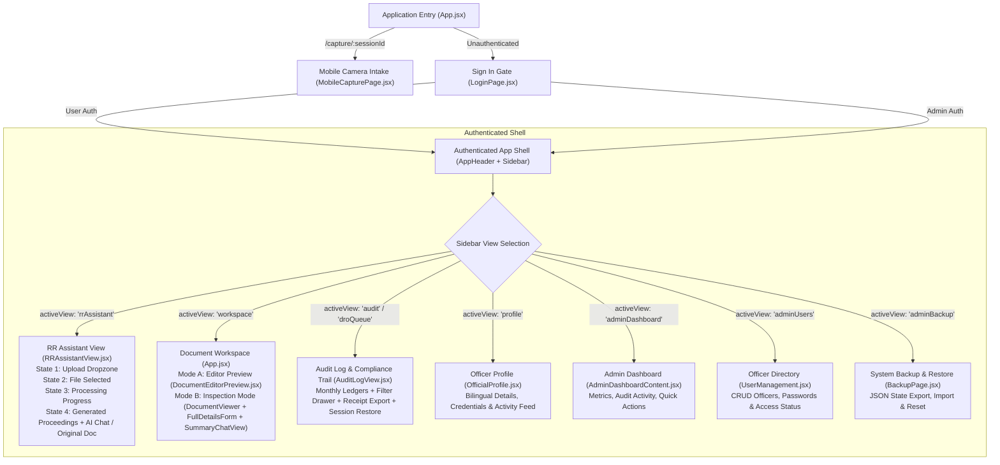

# UI/UX Design Specification

> **Document ID**: RR-UX-001  
> **Version**: 2.1  
> **Date**: 2026-09-28  
> **Product**: AI Administrative Co-Pilot — RR Assistant  
> **Classification**: Official UI Specification (Aligned to Live Codebase)  
> **Status**: APPROVED  

---

## 1. Design System & Visual Foundation

The RR Assistant UI adheres strictly to the official Government of Tamil Nadu Revenue Department design tokens implemented in [`Frontend/src/index.css`](file:///e:/Projects/Active/POC-RR-2-PROCEEDINGS/Frontend/src/index.css). The aesthetic combines **state administrative authority**, **clean high-contrast readability**, and **modern AI co-pilot ergonomics**.

### 1.1 Color Tokens & Palette

The application uses an authoritative administrative color scheme:

| Token Name | Hex / Value | Code Reference | UI Application & Usage |
|---|---|---|---|
| **Deep Navy** | `#102C57` | `--deep-navy`, `--primary`, `--sidebar-bg` | Left navigation sidebar, topbar background, primary CTAs, headings, table headers |
| **White** | `#FFFFFF` | `--white`, `--bg-card` | Content cards, document sheets, input fields, modal dialogs |
| **Cream** | `#FEFAF6` | `--cream`, `--bg-primary`, `--body-bg` | Main application background, document editor margins, preview backgrounds |
| **Soft Sand** | `#EADBC8` | `--sand-soft`, `--border-subtle` | Subtitles, subtle borders, card separators, muted button outlines |
| **Warm Tan** | `#DAC0A3` | `--tan-warm`, `--border-card` | Accent borders, pill badges, active sidebar indicators, dashed dropzone borders |
| **Accent Emerald** | `#102C57` (High Contrast) | `--accent-emerald` | Verified badges, Grounding confidence scores, successful dispatches |
| **Warning Amber** | `#DAC0A3` / `#F59E0B` | `--accent-amber` | Hallucination risk warnings (>0.20 threshold alert), unverified draft badges |

### 1.2 Typography System

The application is built for seamless **Tamil-English bilingual administrative operations**:

```css
--font-sans: 'Plus Jakarta Sans', 'Outfit', 'TAU-Marutham', 'Noto Sans Tamil', -apple-system, BlinkMacSystemFont, sans-serif;
--font-tamil: 'TAU-Marutham', 'Noto Sans Tamil', 'Latha', 'Plus Jakarta Sans', sans-serif;
--font-mono: 'JetBrains Mono', monospace;
```

- **English UI Elements**: `Plus Jakarta Sans` / `Outfit` for crisp, legible navigation, metric cards, labels, and system controls.
- **Tamil Proceedings Order Sheet**: `TAU-Marutham` / `Noto Sans Tamil` rendered at `13px`–`15px` with a generous line-height of `1.8`–`1.85` to ensure complex Tamil ligatures, vowel signs, and legal numerals render without clipping.
- **Cryptographic Hashes & Reference IDs**: `JetBrains Mono` for ROC numbers, case IDs, SHA-256 hashes, and pagination indices.

---

## 2. Information Architecture & Navigation

The application is structured into **public utility routes**, **authentication gates**, and an **authenticated dual-role administrative workspace**:



### 2.1 Navigation Shell Structure

The main application container ([`App.jsx`](file:///e:/Projects/Active/POC-RR-2-PROCEEDINGS/Frontend/src/App.jsx)) provides a fixed-height (`100vh`), overflow-managed viewport layout:

1. **Top Application Bar (`AppHeader.jsx`)**:
   - **Left**: Mobile hamburger toggle button (`Menu`/`X`), Tamil Nadu Government Emblem (`/assets/tn_emblem.svg`), App title **RR Assistant**, and bilingual subtitle: `"Revenue Recovery Proceedings"` / `"வருவாய் வசூல் செயல்முறைகள்"`.
   - **Right**:
     - Admin Notification Bell (with unread activity count badge for Admins).
     - Bilingual Language Switcher (`English` / `தமிழ்`).
     - Officer Profile Pill: Displays officer avatar icon, official name, role badge (`Admin` or `User`), and dropdown chevron (`▲`/`▼`) with options for **Official Profile** and **Sign Out**.

2. **Collapsible Sidebar (`Sidebar.jsx`)**:
   - Width: `216px` expanded, `64px` collapsed (smooth `0.25s` cubic-bezier transition).
   - Background: Dark Navy (`#102C57`) with warm tan accents (`#DAC0A3`).
   - **Admin Navigation Block** (visible only when `currentUser.role === 'admin'`):
     - Dashboard (`LayoutDashboard` icon)
     - User Management (`Users` icon)
     - Backup (`DatabaseBackup` icon)
   - **Officer Navigation Block**:
     - RR Assistant (`FileText` icon) — Main AI processing hub.
   - **Bottom Navigation Block**:
     - Audit Logs (`History` icon) — Historical ledgers and session restoration.
     - Collapse / Expand Toggle (`ChevronLeft` / `ChevronRight`).

---

## 3. Screen Specifications (Exact Codebase Layouts)

### 3.1 Login Page (`LoginPage.jsx` & `LoginPage.css`)

**Layout**: Split-screen design with administrative identity branding on the left and login form on the right.

```
┌───────────────────────────────────────┬───────────────────────────────────────┐
│              LEFT PANE                │              RIGHT CARD               │
│        (login-identity, 50%)          │         (login-content, 50%)          │
│                                       │                                       │
│  🏛️ Erode Collectorate                │  Sign in                              │
│     RR Assistant                      │  Enter your account details...        │
│                                       │                                       │
│          [ TN State Seal ]            │  Role:  (o) User     ( ) Admin        │
│                                       │                                       │
│  Revenue Recovery proceedings         │  Username / Email                     │
│  workspace                            │  [ ramanathan@tn.gov.in             ] │
│                                       │                                       │
│  "மக்களின் குரல்,                     │  Password                             │
│   அரசின் செயல்."                      │  [ **********                     👁 ] │
│  (Alternates every 4.5s with:         │                                       │
│   "Listening to Citizens,             │  [x] Remember me                      │
│    Acting with Precision.")           │                                       │
│                                       │  [ Sign in                       -> ] │
└───────────────────────────────────────┴───────────────────────────────────────┘
```

- **Brand Pane (Left)**: Deep Navy background with subtle geometric grid overlay. Features the official Tamil Nadu emblem and an animated bilingual motto heading with smooth 400ms cross-fade between Tamil and English.
- **Sign-in Card (Right)**:
  - Role Radio Group: Custom styled radio pill toggles between `User` and `Admin`.
  - Input Fields: Floating-style labels with `#DAC0A3` subtle focus glow.
  - Password Input: Includes toggleable `Eye` / `EyeOff` visibility icon.
  - Submit Button: Full-width dark navy button with `ArrowRight` icon and active busy spinner.

---

### 3.2 RR Assistant Primary Hub (`RRAssistantView.jsx`)

The primary workspace for Section Officers follows a 4-state workflow machine:

#### State 1: Upload Card (`workflowState === 'upload'`)
- **Layout**: Centered administrative intake card on `#FEFAF6` cream canvas.
- **Components**:
  - State Seal: Centered 66px TN emblem with soft drop-shadow.
  - Heading: "RR Proceedings Assistant" + instruction subtitle.
  - Drag-and-Drop Card: 490px wide card with `#DAC0A3` 2px dashed border (`#FEFAF6` on dragover).
  - Circular Upload Icon: 56px `#FEFAF6` circle with `UploadCloud` icon in `#102C57`.
  - Action Button: **"Browse Document"** dark navy button (triggers native file dialog accepting `.pdf`, `.png`, `.jpg`, `.jpeg`, `.webp`).
  - Supported Formats Legend: `PDF • JPG • PNG • WEBP`.
  - Divider: Horizontal separator with centered **"OR"** badge.
  - Mobile QR Trigger: **"Scan using mobile"** button with `Smartphone` icon (opens `MobileQrModal.jsx`).

#### State 2: Document Ready (`workflowState === 'file_selected'`)
- **Components**:
  - Uploaded Document Card: Displays file icon, verified file name, and formatted size.
  - "[ Change Document ]" ghost button to revert to upload state.
  - Primary Action Button: **"Generate Official Content"** (navy button with 14px shadow, triggers ingestion pipeline).

#### State 3: Processing Pipeline Overlay (`workflowState === 'processing'`)
- **Components**: Centered status card with spinning `RefreshCw` icon and a 5-stage progress indicator with dynamic checkmarks:
  1. `Reading the uploaded document`
  2. `Running OCR`
  3. `Extracting legal entities with LLM`
  4. `Validating amounts and jurisdiction`
  5. `Generating the final official template`

#### State 4: Generated Proceedings Workspace (`workflowState === 'generated'`)
- **Top Bar**:
  - Document metadata: Reference file name and status.
  - Quick action buttons:
    - **"Copy"** (`Copy`/`Check` icon with clipboard feedback).
    - **"Download PDF"** (`Printer` icon, opens printable A4 view).
    - **"Download DOCX"** (`Download` icon, primary navy button downloading generated Word document).
    - **"+ New Upload"** (`PlusCircle` icon, resets workflow).
- **Split Workspace Grid (`60% : 40%`)**:

```
┌───────────────────────────────────────────────┬───────────────────────────────────────┐
│     LEFT PANEL: EDITABLE PROCEEDINGS (60%)    │   RIGHT PANEL: AI CHAT / DOC (40%)    │
├───────────────────────────────────────────────┼───────────────────────────────────────┤
│ ✏️ Generated Content (Editable)               │ 💬 RR Assistant   [Original Petition ◀]│
│ "Click directly in the area below to edit..." │                                       │
│                                               │ 🤖 Your proceedings are ready in the   │
│ ┌───────────────────────────────────────────┐ │    fixed template. Review on left...  │
│ │ ந.க.9667/2026/ஈ2            நாள்: 28.09.2026│                                       │
│ │                                           │ 👤 Change the taluk to Perundurai       │
│ │ பொருள்: வருவாய் வசூல் சட்டம் — மோட்டார்   │                                       │
│ │ வாகன விபத்து இழப்பீடு தீர்ப்பாயம்...      │ 🤖 The requested revision has been     │
│ │                                           │    applied. Updated on left.          │
│ │ பார்வை:                                    │                                       │
│ │ 1. நீதிமன்ற ஆணை எண் MCOP 109/2022        │ ┌───────────────────────────────────┐ │
│ │ 2. அரசாணை எண்...                          │ │ Describe a change to proceedings..│ │
│ │                                           │ └───────────────────────────────────┘ │
│ │                                           │ [📎 Attach]  [🎤 Voice Input]  [Send ->]│
│ └───────────────────────────────────────────┘ │                                       │
└───────────────────────────────────────────────┴───────────────────────────────────────┘
```

- **Left Panel (60%)**: Full-height textarea styled in `'TAU-Marutham'` font (`0.94rem`, line-height `1.85`), with direct on-screen editing and auto-save to `localStorage`.
- **Right Panel (40%)**:
  - **View A (AI Chat Panel)**:
    - Chat header with toggle button: **"Original Petition ◀"**.
    - Live conversation log showing prompt history and system confirmation messages.
    - Multi-line instruction input: `Enter` to submit revision, `Shift+Enter` for line-break.
    - Bottom controls: **"Attach"** (`Paperclip`), **"Voice Input"** (`Mic`), and **"Send"** (`Send` icon with loading spinner).
  - **View B (Original Scanned Document Viewer)**:
    - Dark navy container (`#0B192C`) with page pagination controls (`‹ 1 / 1 ›`).
    - **"CLOSE"** button returning to chat mode.
    - Full-resolution preview of the uploaded source scan.

---

### 3.3 Document Workspace — Dual Mode (`App.jsx` -> `activeView === 'workspace'`)

When an officer switches to the detailed Document Workspace, they have access to a top **Mode Switcher**:

1. **Button 1**: `📰 செயல்முறை ஆணை மாதிரி & AI திருத்தம் (Document Editor & AI Re-generation)` -> Mode 1
2. **Button 2**: `🔍 முழு விவரங்கள் & OCR ஆய்வு (Entities & OCR Inspection)` -> Mode 2
3. **Right Controls**: Case Number pill (`badge-emerald`) + **"Dispatch to DRO Portal"** button.

#### Mode 1: Document Editor & AI Re-generation (`DocumentEditorPreview.jsx`)
- **Inputs & AI Re-generation Section**:
  - Collapsible card with header toggle (`ChevronDown`/`ChevronUp`).
  - **பொருள் (Subject) Textarea**: Pre-filled with Tamil administrative subject line.
  - **AI Prompt Box**: Purple-tinted guidance box with prompt chips for quick correction:
    - `"Change taluk to Perundurai"`
    - `"Set principal to ₹5,00,000"`
    - `"Format as Press Release"`
    - `"Update Insurer to United India Insurance"`
  - Button: **"AI மூலம் திருத்தி DOCX உருவாக்கு"** (re-generates DOCX with updated LLM context).
- **Success Action Bar**:
  - Success badge: **"வெற்றிகரமாக உருவாக்கப்பட்டது! (Successfully Created!)"** with reference ROC number, date, and "Template" badge.
  - Action buttons: `Edit` (toggles inline editable textarea), `Copy`, `PDF`, `DOCX` (primary navy button), and `+ New Document`.
- **A4 Document Preview**: White paper canvas rendering the complete Tamil proceedings order.

#### Mode 2: Side-by-Side Inspection (3-Column Layout)

```
┌───────────────────────────┬───────────────────────────┬───────────────────────────┐
│     DOCUMENT VIEWER       │     FULL DETAILS FORM     │     SUMMARY RAG CHAT      │
│     (DocumentViewer)      │     (FullDetailsForm)     │     (SummaryChatView)     │
├───────────────────────────┼───────────────────────────┼───────────────────────────┤
│ [Interactive] [Raw OCR]   │ Grounding: 96% | Risk: 0.04│ 💬 RAG Document Assistant │
│ Zoom: [-] 100% [+]  [⟲]   ├───────────────────────────┤                           │
│                           │ 1. Court & Case Reference │ "What is the award        │
│ ┌───────────────────────┐ │ • Court: Sub Court Erode  │  amount?"                 │
│ │ [BBox: MCOP 109/2022] │ │ • Case No: MCOP 109/2022  │                           │
│ │                       │ │ • Order Date: 2022-03-15  │ 🤖 The principal award is  │
│ │ [BBox: ₹4,81,459/-]   │ │                           │    ₹4,81,459/- with 7.5%  │
│ │                       │ │ 2. Defaulter Particulars  │    interest from filing.  │
│ │                       │ │ • Name: Thiru P.Nallasivam│    [Citation: Box-3]      │
│ │                       │ │                           │                           │
│ │                       │ │ 3. Financial Recovery     │ Suggested Queries:        │
│ │                       │ │ • Principal: ₹4,81,459    │ [Who is defaulter?]       │
│ │                       │ │ • Interest: 7.5%          │ [Which court issued?]     │
│ └───────────────────────┘ │                           │                           │
│ [‹] Page 1 of 1 [›]       │ [Recalculate] [Dispatch]  │ [ Ask order context... ->]│
└───────────────────────────┴───────────────────────────┴───────────────────────────┘
```

1. **Column 1 (`DocumentViewer.jsx`)**:
   - Tabs: `Interactive Layout` (scanned document with interactive bounding boxes) vs `Raw OCR` (text output).
   - Controls: Zoom In (`ZoomIn`), Zoom Out (`ZoomOut`), Reset (`RotateCcw`), and Page controls.
   - Bounding Boxes: Hovering a bounding box shows the field key; clicking highlights the corresponding input field in Column 2.
2. **Column 2 (`FullDetailsForm.jsx`)**:
   - Grounding Badge: Displays AI confidence percentage and Hallucination Risk index.
   - Mandatory Review Warning: Displays high-visibility amber banner if Hallucination Risk > 0.20.
   - Grouped Form Sections:
     - Section 1: Court & Case Reference (Court Name, Case Number, I.A. Number, Order Date, ROC Number).
     - Section 2: Defaulter / Respondent Particulars (Defaulter Name, Father/Husband Name, Full Address, Insurer Name).
     - Section 3: Financial & Recovery Claims (Principal Award, Interest Rate %, Interest Amount, Legal Costs, Total Recovery Amount).
     - Section 4: Jurisdiction & Revenue Taluk (Revenue District, Taluk Name, Directed Tahsildar).
     - Section 5: Relevant Legal Acts (TN Revenue Recovery Act 1864, Section 5, Section 52).
   - Bottom Bar: **"Recalculate & Re-generate"**, **"Preview Official Tamil Order"**, **"Download DOCX"**, and **"Dispatch to DRO Portal"**.
3. **Column 3 (`SummaryChatView.jsx`)**:
   - RAG Q&A Assistant connected to extracted document vectors.
   - Quick prompt pills: `"What is the award amount?"`, `"Who is the defaulter?"`, `"Which court issued the order?"`.
   - Citations: Clickable citation tags (e.g. `[Box-3]`) trigger automatic bounding box highlight and zoom in Column 1.

---

### 3.4 Audit Log & Compliance Ledger (`AuditLogView.jsx`)

The audit log provides an immutable record of all processed court orders and dispatches:

- **Filter Bar**:
  - Global Search: Real-time search across Case Number, ROC Number, Defaulter Name, Taluk, and Officer.
  - Officer Dropdown: Filter by all active Section Officers.
  - Status Dropdown: `ALL`, `DISPATCHED`, `FLAGGED`, `VERIFIED`, `DRAFT`.
  - Date / Year / Month / Day granular pickers.
  - Advanced Filter Drawer (`AuditFilters.jsx`): Multi-tag filtering by amount range, hallucination risk, and court type.
- **Metric Cards Summary**:
  - Total Logged Proceedings
  - Dispatched to DRO Portal
  - Flagged for Review
  - Mean Grounding Confidence (%)
- **Monthly Ledger Grouping**:
  - Grouped by month (e.g., `"September 2026"`).
  - Row Data: Case Number, Proceedings ROC, Defaulter Name, Taluk, Recovery Amount, Status Badge, Grounding Bar.
  - Actions per entry:
    - **"Restore Session"**: Restores historical document and prompt conversation directly into `RRAssistantView.jsx` (ChatGPT/Gemini session restore pattern).
    - **"Audit Receipt"**: Generates a printable compliance receipt including the official cryptographic SHA-256 hash and DRO sync receipt.
    - **"Export JSON"**: Downloads complete audit ledger in JSON format.

---

### 3.5 Administration Hub (`AdminWorkspace.jsx`)

Available exclusively to users with `role === 'admin'`:

1. **Dashboard Tab (`AdminDashboardContent.jsx`)**:
   - 4 System Metrics:
     - `Active Officers` (in officer directory)
     - `Total Orders` (saved proceedings sessions)
     - `Success` (verified and dispatched proceedings)
     - `Failure / Draft` (awaiting officer verification)
   - Recent Activity Stream: Live timeline of officer sign-ins, document generations, edits, and DRO dispatches.
   - Recent Orders Table with quick navigation.

2. **User Management Tab (`UserManagement.jsx`)**:
   - Comprehensive officer directory table: Officer ID, Name, Tamil Name, Designation, Section/Taluk, Role, Status (`active`/`inactive`).
   - Actions: **"Add New Officer"** modal, **"Edit Officer"** modal, **"Reset Password"** modal, and **"Deactivate / Activate"** toggle.

3. **Backup & System Maintenance Tab (`BackupPage.jsx`)**:
   - **Export Workspace Backup**: Downloads entire system state (users, audit logs, drafts, preferences) as an encrypted JSON archive.
   - **Import Workspace Backup**: File upload restoring full application state with validation checks.
   - **Reset System Data**: Controlled factory reset wiping test records while preserving master administrator accounts.

---

### 3.6 Official Profile (`OfficialProfile.jsx`)

Personal profile management accessible from the topbar avatar menu:

- **Profile Card**: Displays Officer Avatar, Official Name (English & Tamil), Designation, Department Unit (Section), Assigned Office (Erode Collectorate), Official Email, Mobile Number, and Access Role.
- **Edit Mode**: Allows officers to update contact information and designations.
- **Activity Summary**: Displays officer's recent document processing and dispatch history.

---

### 3.7 Mobile Camera Intake (`MobileCapturePage.jsx`)

Accessible on mobile smartphones at `/capture/:sessionId` (requires **no login** for rapid field capture):

- **Header**: Tamil Nadu government seal with "Mobile Document Intake".
- **Intake Modes**:
  - **Camera Capture** (`Camera` icon): Activates device camera to photograph physical court orders directly.
  - **Gallery / File Picker** (`Upload` icon): Selects images or PDFs from device storage.
- **Capture Review**: Displays photo thumbnail, file size, custom petition name input, and high-visibility **"Upload Document"** button.
- **Real-Time Desktop Sync**: Upon upload completion, desktop `MobileQrModal.jsx` automatically detects the new file via session polling and immediately loads it into the desktop workspace.

---

### 3.8 Modals & Overlays

1. **Mobile QR Modal (`MobileQrModal.jsx`)**:
   - Displays dynamic QR code pointing to `https://<host>/capture/<sessionId>`.
   - Polling status spinner checking for completed smartphone uploads.
   - "Copy Mobile URL" button and "Simulate Upload" button for testing.
2. **Proceedings Preview Modal (`Modals.jsx` -> `ProceedingsPreviewModal`)**:
   - High-fidelity A4 modal displaying the official Tamil Nadu State Seal, reference headers, full Tamil proceedings decree, signature blocks, and DOCX download button.
3. **DRO Portal Dispatch Receipt Modal (`Modals.jsx` -> `DroReceiptModal`)**:
   - Confetti burst animation upon dispatch.
   - Displays DRO portal submission acknowledgment reference number, submission timestamp, and cryptographic verification hash.

---

## 4. Design Verification & Accessibility Standards

| Requirement | Implementation in Codebase |
|---|---|
| **Color Contrast** | WCAG 2.1 AA compliant. `#102C57` on `#FFFFFF` provides a contrast ratio of **13.4:1** (exceeds AAA requirement of 7:1). |
| **Bilingual Support** | Instant toggle between English and Tamil across all navigation elements, modals, headers, and document preview areas. |
| **Tamil Script Rendering** | Enforces `TAU-Marutham` and `Noto Sans Tamil` with line-heights ≥1.8 to prevent glyph clipping. |
| **Responsive Layout** | Breakpoint adaptations: Desktop (full 3-column / 60:40 split), Tablet (collapsible sidebar), Mobile (full-screen mobile capture at `/capture/:sessionId`). |
| **Keyboard Accessibility** | All interactive elements (`button`, `input`, `textarea`) have visible focus rings (`--border-focus: #102C57`) and ESC key listeners for modals. |
| **Error Feedback** | Contextual alert banners for hallucination threshold violations (>0.20), connection status warnings, and form validation errors. |

---

*This specification represents the exact implementation of the RR Assistant UI/UX as maintained in the application source code.*
